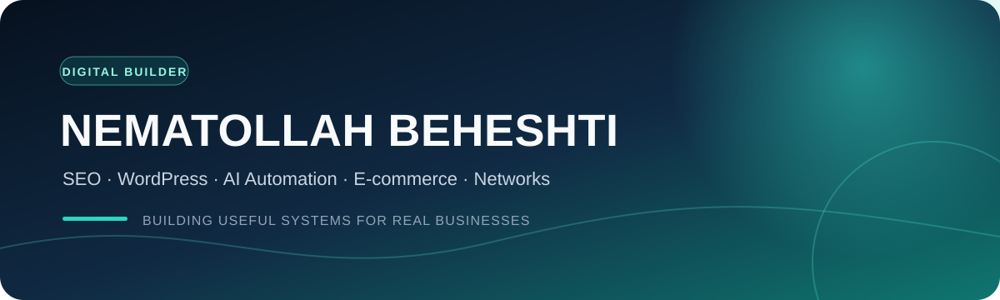

  

<h3 align="center">Digital growth systems that connect search, content, commerce and automation</h3>

  <a href="https://parsarena.com">Pars Arena</a>
  ·
  <a href="https://github.com/nematbeheshty">GitHub Profile</a>

## About me

I build practical digital systems for real businesses—combining SEO strategy, content operations, WordPress and WooCommerce development, AI-assisted automation, e-commerce management and computer networking.

من نعمت‌الله بهشتی هستم؛ تمرکزم روی ساخت و بهبود سیستم‌هایی است که به رشد واقعی کسب‌وکار کمک می‌کنند: از دیده‌شدن در جست‌وجو و تجربه بهتر سایت تا اتوماسیون فرایندها، مدیریت فروشگاه اینترنتی و زیرساخت شبکه.

## Core expertise

- **SEO & content systems:** search-intent mapping, on-page SEO, technical audits, topical architecture and performance analysis
- **WordPress & WooCommerce:** custom storefront experiences, conversion-focused pages, performance and operational workflows
- **AI automation:** human-in-the-loop content pipelines, structured prompts, API-based workflows and repeatable operations
- **E-commerce operations:** catalog quality, customer journey, merchandising, publishing and growth experiments
- **Computer networks:** implementation, troubleshooting and dependable small-business network infrastructure

## Featured work

| Project | Focus | Current stage |
|---|---|---|
| [Pars Arena](https://parsarena.com) | Technology e-commerce, WordPress, WooCommerce, SEO and content operations | Active |
| Pars Arena Newsbot | Source-aware Persian editorial automation with human review | Foundation |
| SEO content workflows | Repeatable research, optimization and publishing systems for business websites | Ongoing |

## Toolkit

  
  
  
  
  
  
  
  

## How I work

1. Start with the business outcome and the user journey.
2. Turn assumptions into measurable, testable changes.
3. Keep credentials, customer data and publishing permissions outside source code.
4. Document the system so it can be operated, reviewed and improved.
5. Use automation to support human judgment—not replace accountability.

## Current focus

- Developing Pars Arena's search and content ecosystem
- Designing a secure editorial automation workflow for Persian technology news
- Turning repeatable WordPress, SEO and e-commerce work into documented systems
- Publishing practical case studies as projects become ready for public release

---

  <strong>Open to thoughtful collaboration on SEO, WordPress, e-commerce and responsible automation.</strong>

